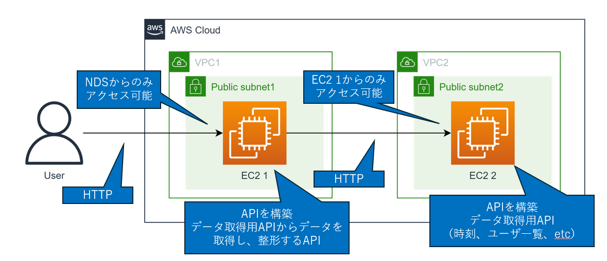

# Terraform
https://developer.hashicorp.com/terraform/install

```
wget -O- https://apt.releases.hashicorp.com/gpg | sudo gpg --dearmor -o /usr/share/keyrings/hashicorp-archive-keyring.gpg
echo "deb [signed-by=/usr/share/keyrings/hashicorp-archive-keyring.gpg] https://apt.releases.hashicorp.com $(lsb_release -cs) main" | sudo tee /etc/apt/sources.list.d/hashicorp.list
sudo apt update && sudo apt install terraform
```
Terraform install
```
brew install tfenv
tfenv list-remote
tfenv install 1.12.1
tfenv list
tfenv use 1.12.1
tfenv pin

terraform -v
terraform fmt --recursive
```
tflint install
```
brew install tflint
touch .tflint.hcl

plugin "terraform" {
    enabled = true
    preset = "recommended"
}
plugin "aws" {
    enabled = true
    version = "0.35.0"
    source = "github.com/terraform-linters/tflint-ruleset-aws"
}

tflint --init
tflint --recursive
```
trivy install
```
brew install trivy
trivy config .
```

terraform deploy
```
cd ./envs/dev

terraform init
terraform plan
terraform apply
terraform destroy

terraform init --upgrade

terraform.tfvarsファイルを作成して
resourceName = "user"
specificAddress = "x.x.x.x/32" 許可したいIp
```
-----
# コマンド補完を有効にする
https://docs.aws.amazon.com/ja_jp/cli/v1/userguide/cli-configure-completion.html

complete -C '/usr/local/bin/aws_completer' aws

-----
# フォルダ構成
```
envs
  dev
    main.tf
  stg
  prd
modules
  ec2
   ec2作成
  network
    vpc作成
  peering
    peering作成
```
envs 配下に環境ごとの設定値

modules 配下に、構築するリソース

envs/dev 配下で、terraform コマンドを打つこと